# Pan Tilt Camera

Raspberry Pi and Servo motors to make a motion security camera

Keep an eye out while you're out for the holidays! Use this pan-tilt camera to monitor your home; using a web-accessible interface to pan around the room. You can also set up email alerts for when it detects motion, and get it to follow regions of interest! Raspberry Pi and SD card not included.

## Table Of Contents

- [Pan Tilt Camera](#Pan-Tilt-Camera)
  - [Table Of Contents](#Table-Of-Contents)
  - [Bill Of Materials](#Bill-Of-Materials)
    - [You might also need](#You-might-also-need)
  - [System Overview](#System-Overview)
  - [Integration and Assembly](#Integration-and-Assembly)
    - [Starting up Raspbian Lite](#Starting-up-Raspbian-Lite)
  - [First Boot and logging into Raspbian](#First-Boot-and-logging-into-Raspbian)
  - [Console font setup](#Console-font-setup)
    - [Configuring the system (and fixing the keyboard)](#Configuring-the-system-and-fixing-the-keyboard)
    - [Downloading the project](#Downloading-the-project)
    - [Assembly of the Pan Tilt Bracket kit](#Assembly-of-the-Pan-Tilt-Bracket-kit)
  - [Use](#Use)
  - [Future Improvements](#Future-Improvements)
  - [Further Reading](#Further-Reading)

## Bill Of Materials

| Qty | Code                                     | Description                      |
| --- | ---------------------------------------- | -------------------------------- |
| 1   | [XC9050](https://jaycar.com.au/p/XC9050) | GPIO Shield for RPI              |
| 2   | [YM2758](https://jaycar.com.au/p/YM2758) | Micro Servo                      |
| 1   | [XC4618](https://jaycar.com.au/p/XC4618) | Pan-Tilt Bracket \*              |
| 1   | [XC9021](https://jaycar.com.au/p/XC9021) | 5MP Raspberry Pi Camera with IR. |

- Note you could also print your own 3D bracket, the setup would still be the same.

### You might also need

- Noobs 16GB SD card: ([XC9030](https://jaycar.com.au/p/XC9030))
- Blank 32GB SD card: ([XC4992](https://jaycar.com.au/p/XC4992))
- RPi Power Pack: ([XC9060](https://jaycar.com.au/p/XC9060))
- RPi 3B+: ([XC9001](https://jaycar.com.au/p/XC9001))

## System Overview

This project is a mix of two projects. The bulk of the code is done by Bob Tidey and others with the **RPi Cam Web Interface** Project, found on github: <github.com/silvanmelchior/RPi_Cam_Web_Interface>

Along with that, we have some changes that we use to attach the servo mount control to the project, So the final system looks something like this:

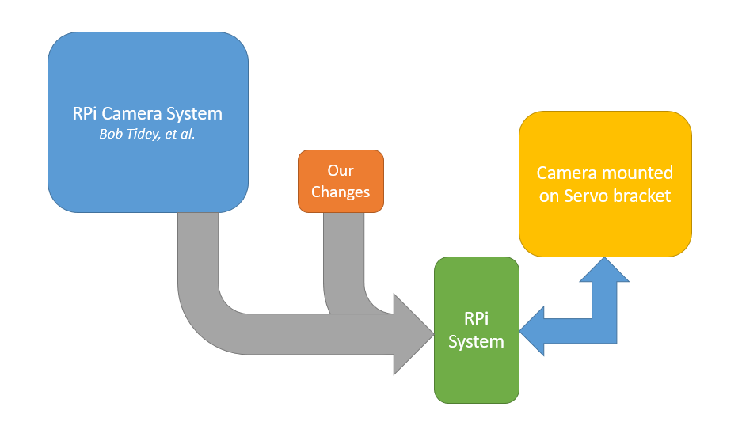

We've made the entire process very simple by bundling all the commands into one simple `install-pan-tilt-camera.sh` script file. If you already have a Raspberry Pi setup, you could simply download this project and run that script, it should still work the same, but is not tested at the moment (Jump to [Downloading the project](#Downloading-the-project) section).

Feel free to post issues on the github repo if you have trouble installing on a NOOBS or other linux on the raspberry pi.

The instructions below builds the system from a bare "Raspbian Lite" build, building the system entirely from the console, saving a lot of space, downloads-less, and is all the more lean of a system. If this sounds like something you're interested in building, then read on.

The original documentation for the RPi Cam Interface can be found here: <https://elinux.org/RPi-Cam-Web-Interface#Basic_Installation>. You should check this out if you have any issues with the interface or you want to find out what else it can do.

## Integration and Assembly

As we are starting out with a bare Raspbian Lite OS, there is some setup we must first do before we can run the command. We've split the below into sections so you can skip bits and jump around, and come back if you have any issues. We recommend setting up the software first so that the servos can initialise to be at 90 degrees, then commence assemble the pan-tilt bracket kit.

### Starting up Raspbian Lite

Firstly, we must download the latest version of Raspbian Lite. Head over to <https://www.raspberrypi.org/downloads/raspbian/> and select `Raspbian Buster Lite`.

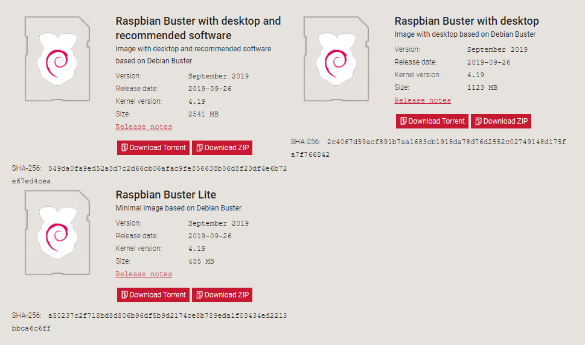

If you're new to linux, or have only ever used NOOBS, and don't understand the "Buster" reference; This is to tie with the _Debian Linux_ releases (as Rasp*bian* is a variant of De*bian*). The actual name is chosen from [ToyStory characters](https://www.debian.org/doc/manuals/debian-faq/ch-ftparchives#s-sourceforcodenames)

- A Debian _Release_ is a version of all related software that are expected to work together. The next release in the near future will be _bullseye_.

Next up we want to use a software program called _BalenaEtcher_ to burn the raspbian image onto SD card. Head over to <https://www.balena.io/etcher/> and download and install. You should find that this is a pretty simple program to use.

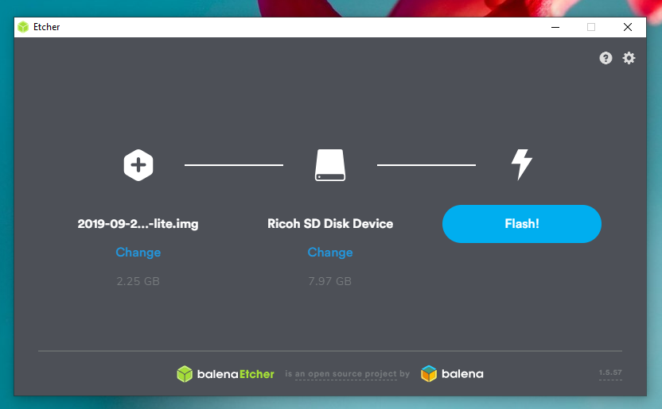

Load up your Raspbian_Lite.zip you downloaded before, and select the right SD card, then press Flash.

Once it's finished, remove the card, put it in the pi, and boot it up.

## First Boot and logging into Raspbian

When you first boot up the card, it might take a little while and will come up with "Resizing Filesystem" messages. Don't worry about that for now, it's just getting cozy in the SD card you used.

Once it's finished, you'll come to a login prompt, you can login with the below information:

```plaintext
username: pi
password: raspberry
```

_Note, you will not be able to see the password when you type it in._

## Console font setup

This part is to change the look of the console font.

You should be able to skip this section if things are fine, but you might get to a point where characters on the screen show up as squares, or maybe you just want a nicer looking font to work with.

Run the below command once you have logged in:

```sh
sudo dpkg-reconfigure console-setup
```

Select the below settings, `Terminus` being a useful programming font.

- UTF-8
- Latin1 and Latin5
- Terminus
- 8x14

That should fix up most issues; You might have to try some Latin with Cyrillic if there's still squares, or post a screenshots in the issues tab of the project page on github.

### Configuring the system (and fixing the keyboard)

Naturally, without a desktop it is a little less intuitive to set up the system and connect to things like the WiFi. Below is the `raspi-config` command and all the settings we have used in our setup for this project.

If you were to type `"` on the keyboard, you will realise that it comes up as `@` - this is a fairly annoying problem on the raspberry pi, and is due to the creators being based in the UK.

Run the below command and set options as shown.

```sh
sudo raspi-config
```

- Network Options
  - Wi-Fi
    - Australia
    - put in your wifi's SSID
    - put in password
- Localisation Options
  - Keyboard Layout
    - Generic 105-key PC (intl.)
    - Other
    - English (US)
    - English (US) _(with no additional information)_
    - The default
    - No compose
- Interfacing Options
  - Camera enable
  - SSH enable

You can also set other localisation options, for things such as time and numbers, but it's not incredibly important for the time being.

Then press `Tab` and `Right` to select Finish, then reboot and log in again.

### Downloading the project

Once the system is set up, run the below commands.

```sh
wget https://github.com/Jaycar-Electronics/Pan-Tilt-Camera/archive/master.zip

unzip master.zip

cd Pan-Tilt-Camera

./install-pan-tilt-camera.sh

```

As a point of reference, here is a list of all the things that the script will be doing:

- setting the system to download files from australian servers (which is quicker).
- running an update and refreshing what is installed.
- Downloading the `RPi_Cam_Web_Interface`
- unzipping, renaming, and copying the config file from before into it.
- Installing the rpi cam interface.
- Enabling pan and tilt in the interface
- Installing the "driver" for the pan-tilt bracket.
- Connecting everything up and getting it ready for boot.
- Rebooting the system

You'll find that this might take a little while, but you should get a screen that looks like this:

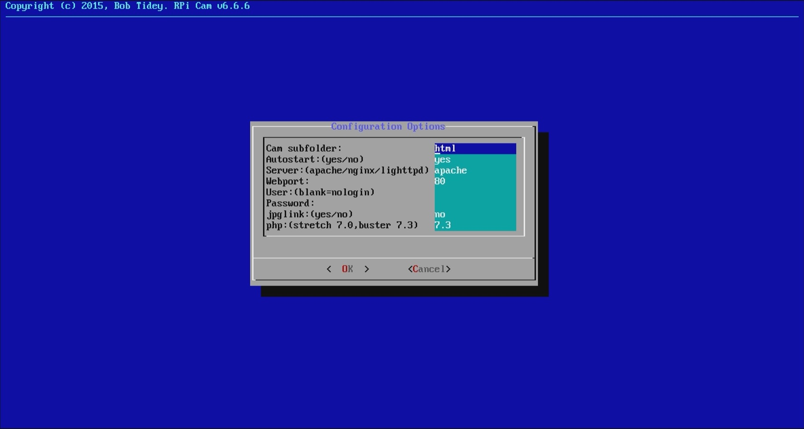

This is just a collection of settings which you can just leave as default. The `Cam subfolder` will change the location of the web-interface to be in `https://ip-address/cam-subfolder` - it shouldn't hurt if you change it, but if it does, submit an issue on github.

Press `Tab` to select `Ok` and press enter, it will then download a tonne more packages.

_(If you're really interested, you can find more information about the configuration options in the [Further Reading](#Further-Reading) section.)_

Once that is done, it will ask if you want to start now; It doesn't matter what you choose as our script will reboot the system anyway.

### Assembly of the Pan Tilt Bracket kit

The original pan tilt kit was designed for a different type of camera, however we can simply snip off the two clips and have a nice flat backing plate to mount the camera onto.

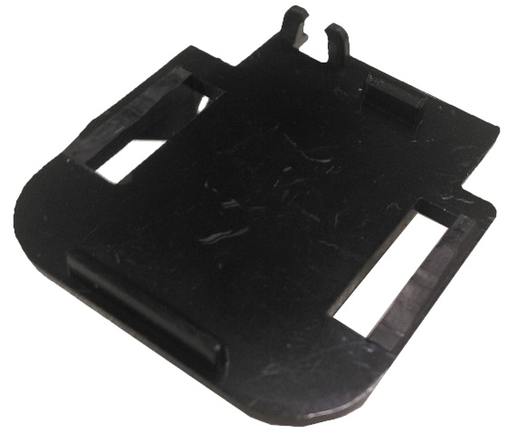

The first thing to do is to use the `+` piece from one of the servo packets and snip that to size so it fits inside of the base of the pan tilt kit, as shown below:

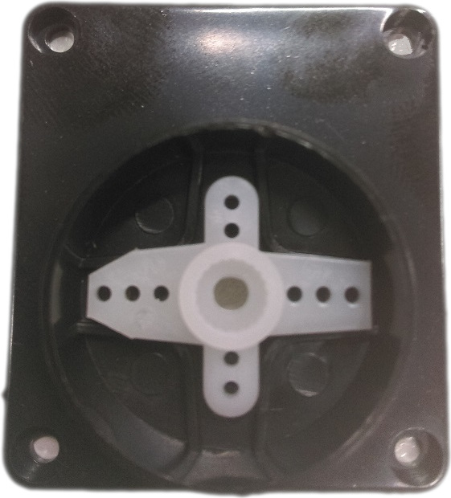

Once this is in, you can screw it into place with some small screws or use some super-glue ([NA1500](https://jaycar.com.au/p/NA1500)) to hold it together

You can then attach the two halves onto the servo and clip them together, before placing into the base so that it looks like the below picture. There should be some screws in the pan-tilt bracket to screw the two halves together.

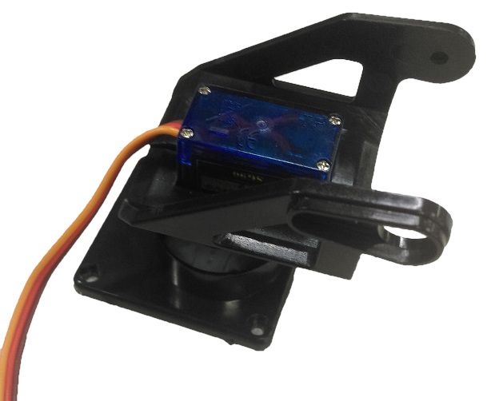

Do not screw the base hub to the servo yet! it will need to be adjusted to the right angle. If you reset the raspberry Pi, the servos should automatically adjust to 90 degrees.

Once the servos are at 90 degrees, then you can screw the hub into the base so that it is positioned straight.

The tilt bracket is easy enough as you can screw it to the back of the plate as such; notice how the single arm piece is coming out of the bottom of the bracket.

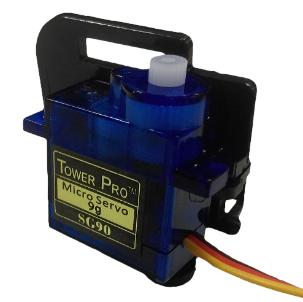

Once that has been done, you can then bend open the two halves from before and slip it in to place, so the final assembly should look something like the below image:

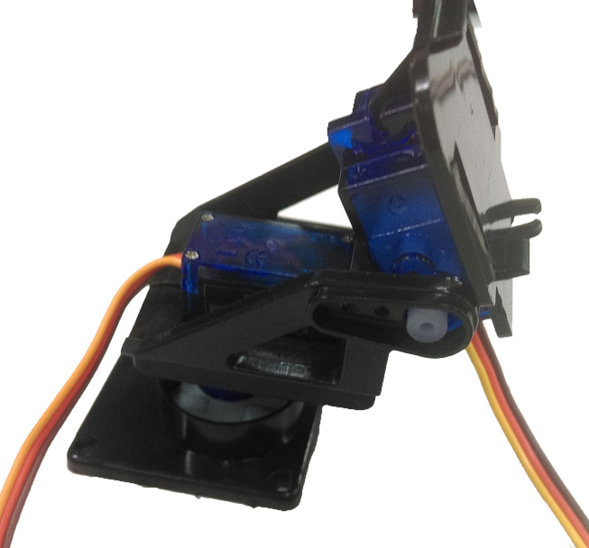

Make sure that the servos are at 90 degrees again, and push in the final servo arm piece into the space as shown on the picture. You will have to snip it down to size so that it can fit.

Once that has been done, you can use [hot glue](https://jaycar.com.au/p/TH2050), [double sided tape](https://jaycar.com.au/p/NM2821), or [glue-strips](https://jaycar.com.au/p/NA1522) to mount the camera onto the plate; Make sure that the cable has full range of movement, as shown in the picture below. We bent the camera cable to come from out the

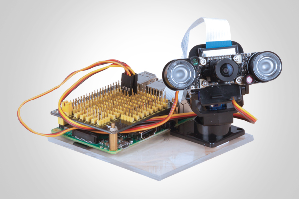

_Also note_ The pinout in the picture above is incorrect, you need to connect the servos to pin 16 and 18.

| Servo                               | Pin |
| ----------------------------------- | --- |
| pan, on the base of the bracket     | 16  |
| tilt, on the camera side of bracket | 18  |

If you want to change the pinout locations, you can do so by editing `/etc/init.d/servoblaster.sh` once the system has been installed.

## Use

At the end of the installation, you should find your pi IP address, for us, this is `10.0.100.149` but yours might be different. You should be able to capture a glimpse of it when you boot up the system, but if not you can simply run the `ifconfig` command to find out:

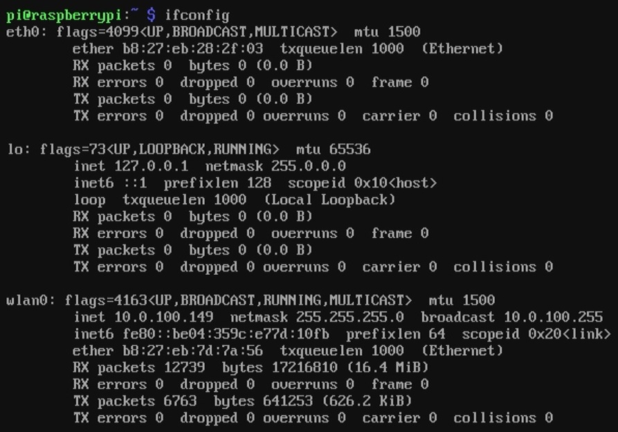

Because we are connected to WiFi, we are looking at the `wlan0` interface, and can see the `inet` is set to `10.0.100.149` on our setup here, but it could be different on your network.

Go to another computer in your house, you should be able to access `https://10.0.100.149` in your browser and find that you have a fully operational camera system; If you have opted to put it into another subfolder in the initial setup, you'll find that folder present in the index, such as `https://10.0.100.149/camera`.

## Future Improvements

This project already has a tonne of work done on it via the guys on the `RPi_Cam_Web_Interface` repo. Go give them a star and see if they have issues that you might be able to fix up.

Other than that, the entire system is very minimal leaving a lot of room for further improvements; obviously you can connect more items to the GPIO shield, and control other things. We would be super interested in Pull requests that include more options on the camera interface as well, such as a button to turn on a light module, or similar.

## Further Reading

- Open CV python tutorials <https://opencv-python-tutroals.readthedocs.io/en/latest/py_tutorials/py_tutorials.html>
- <https://elinux.org/RPi-Cam-Web-Interface#Basic_Installation>
